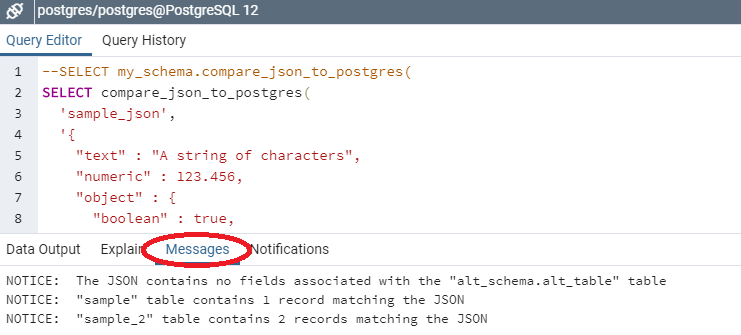

# Compare JSON data against records in a PostgreSQL database

Developing a method to identify whether values in a JSON object have been stored in a database, where JSON fields are mapped to specific database columns.

Two options are provided:
- look up JSON-database mapping details from a reference table in the database; or
- pass an additional JSON argument which contains the mapping details.

The first is likely to be more suitable where the set of mapping details is large, or the function is likely to be used frequently. The second is provided as an alternative in case it is undesirable to maintain mapping details in a database table, and may be better suited for occasional evaluation of small data sets or where the mapping details change frequently.

## Setup

*Note: all scripts include alternative lines (commented out) for defining and using a custom schema if the default 'public' schema is not appropriate. In all cases these are intended to replace, not supplement, the lines which immediately follow them. Users must ensure the relevant lines are updated in all locations, in all scripts if not using the default schema.*

### Sample data

This is provided for demonstration/test purposes (it is not required for normal usage).

Executing the queries in [db_setup.sql](./sql/db_setup.sql) will create sample tables based on [sample.json](./resources/sample.json). The "sample" table will be populated with one record matching the contents of [sample.json](./resources/sample.json) and one non-matching record; the "sample_2" table contains two records which are valid matches, one which should not match as the JSON fields are not mapped and one which should not match as the values are not associated in the JSON. The array in [sample.json](./resources/sample.json) includes a pair of fields ("fake"/"faker") which are not mapped to the matching values in the database so do not produce a match from the comparison function.

### Mapping details

- `json_type` is used to distinguish different payload types e.g. "customer", "account", "transaction".
- `json_path` locates the value in the payload.
- `db_schema`, `db_table`, `db_column` reference the database field where the value should be stored.

#### Database table for mapping details

Executing the queries in [mapping_details.sql](./sql/mapping_details.sql) creates the reference table, populated for the sample structures plus an unused mapping for negative testing. The table created will look like this:

json_type   | json_path      | db_schema     | db_table    | db_column  
:-----------|:---------------|:--------------|:------------|:-----------
sample_json | text           | [null]        | sample      | pg_text    
sample_json | numeric        | [null]        | sample      | pg_numeric
sample_json | object,boolean | [null]        | sample      | pg_boolean
sample_json | object,null    | [null]        | sample      | pg_empty
sample_json | array,int      | [null]        | sample_2    | pg_int
sample_json | array,char     | [null]        | sample_2    | pg_char
sample_json | altObject,int  | alt_schema    | alt_table   | pg_int

#### JSON format for mapping details

See [mappingDetails.json](./resources/mappingDetails.json) for the JSON equivalent of the above.

### Stored functions

Executing the [compare_json_to_postgres.sql](./sql/compare_json_to_postgres.sql) script will add the stored procedure `compare_json_to_postgres(par_json_type text, par_json json)` to the database. This procedure looks for mapping details in a database table.

Executing the [compare_json_to_postgres_json_mapping.sql](./sql/compare_json_to_postgres_json_mapping.sql) script will add the stored procedure `compare_json_to_postgres(par_json_type text, par_json json, par_mapping_details json)` to the database. This procedure requires mapping details to be supplied in JSON format.

When either of the above scripts is executed, a second function, `determine_query_conditions(par_json json, par_paths_with_columns text[][2])` is also created; this function may be called recursively if an array is encountered in the JSON. This helper function is identical for both variants of the main procedure.

*Note: both scripts use `CREATE FUNCTION` statements rather than `CREATE OR REPLACE FUNCTION`, to avoid accidentally overwriting existing functions. If both versions of the main procedure are required, the declaration for the helper function should be omitted when executing the second script.*

The `compare_json_to_postgres` procedure can be invoked as demonstrated in [test_stored_function.sql](./sql/test_stored_function.sql) or [test_stored_function_json_mapping.sql](./sql/test_stored_function_json_mapping.sql), respectively, for the sample data.

Results are output as `RAISE NOTICE` statements. In pgAdmin these are displayed on a separate tab in the Data Output panel:



Additional information is available from `RAISE DEBUG` statements; by default these messages are not displayed but if required they can be viewed by changing the logging level (or changing the code to raise them at NOTICE level).

## Limitations

See [divergent_paths.md](./divergent_paths.md) for a breakdown of how arrays are handled.

There is no handling of references to specific indices in an array:
```
"arr" : ["a", "b", "c"]
```
-> path "arr" matches "a" or "b" or "c"; path "arr,1" matches nothing.
